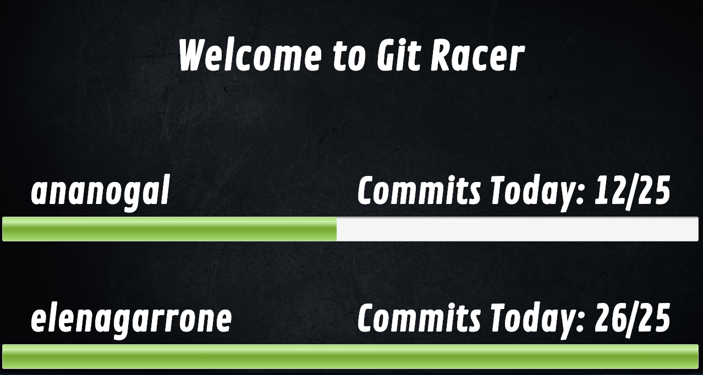

GitRacer
========

A fun little website that tracks github commits and presents it as a racing game

This is how it looks like:

This was a 3 day project, that we had to do in Makers Academy. The objective was to connect to the gitHub API and get the commits of the login user.

How to use it 
===============

Clone the project, and then install all dependencies with `npm install`.  
Then write on your terminal `npm start`.  
Go to your browser and enter in `localhost:300`.  
Enter your gitHub name. Open another tab in localhost and enter a diferent username. You will see that you'll have both users with ther commits.  
Make a commit. It will change the number of commits in the race.

Things to do 
===============

We still have some things to do:
- Make the date not hardcoded
- Make authentication so we don't have problems with keys in github API
- Make the bar and user data small(first version just had one user, so we make it bigger)
- Publish it to heroku

Techonologies used 
===================
- Node.js
- Express
- Mocha
- sockets.io